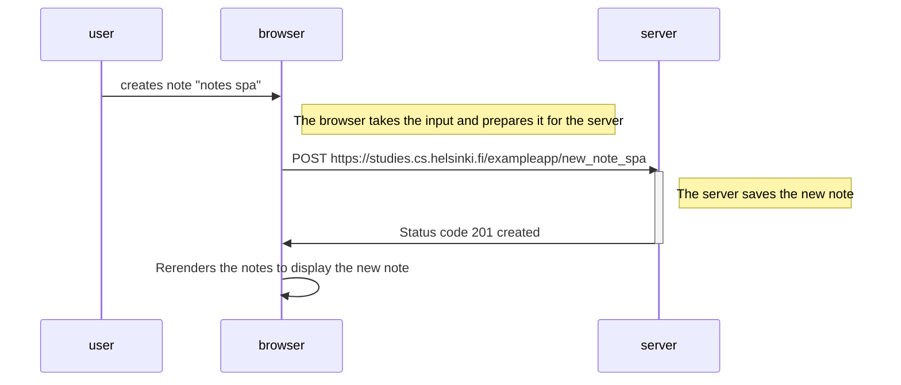

```mermaid

sequenceDiagram
    participant user
    participant browser
    participant server

    user->>browser: creates note "notes spa"
    Note right of browser: The browser takes the input and prepares it for the server

    browser->>server: POST https://studies.cs.helsinki.fi/exampleapp/new_note_spa
    activate server
    Note right of server: The server saves the new note
    server->>browser: Status code 201 created
    deactivate server

    browser->>browser: Rerenders the notes to display the new note
```